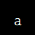
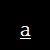
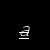
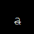

# Validation-475k
There are OCR packages available with which one can convert images to text, but there is limited data available for printed text with lower case, upper case, digits and special characters with varied formatting (bold, italic, underline, and strikethrough). Hence here we are presenting dataset which has 400+ fonts taken from Microsoft Excel with different combinations of formats, each image is unique and total dataset sums up around to 475,000 images

### Introduction to 475K Dataset
In this dataset we have provided images with upper case, lower case, digits, and special characters, totaling to 94 different classes. This dataset includes 407 fonts taken from Microsoft Excel in 16 different formatting options. Formatting options covered are bold, italic, underline, and strikethrough, with these 4 options 16 combinations can be generated for each class. Typically, a single font contains 1168 images, which leads us to around 475,000 images in the dataset, of size 50x50.

### Understanding Dataset
This dataset contains around 475K images divided by classes. Dataset contains 94 classes, out of which class 1 – 66 have 6512 images per class and classes 67-94 have 1628 images per class. Labels and classes are given same name and are classified as follows:
* Classes 1 – 10 are digits (1,2,3…0)
* Classes 11 – 62 are alphabets (lower case and upper case)
* Classes 63 – 66 are special characters having 6512 images per class (‘?’,’&’,’$’,’%’)
* Classes 67 - 94 are rest of the special characters having 1628 images per class, detailed list is included at the end.

**Note**: Kindly unzip the 3 zip files in `dataset/printed_alphabets` manually, code wouldn't do that.

### Metadata:
* All images are 50x50 pixels in size.
* Folder containing images can act as label for that image. E.g. All images for alphabet ‘a’ are in folder named ‘11’.
* Image file follow a naming format: <number>-<formatting>
  * E.g. In folder ‘11’, 1st file name is ‘11-b.png’
  * Here ‘11’ in ‘11-b’ is a unique sequence
  * ‘b’ represents formatting as bold
* Formatting options with their naming symbols used are:
  * Bold: ‘b’, e.g. Sample Text
  * Italic: ‘i’ e.g. Sample Text
  * Underline: ‘u’ e.g. Sample Text
* Strikethrough: ‘s’ e.g. Sample Text
* There are 16 combinations of made from these 4 formatting options, described below
 

### Mapping of Symbol to Label
Following table depicts images and its labels:
|Image|Label|Image|Label|Image|Label|
|------|-----|------|-----|------|-----|
|1|1 |w|33|$|65|
|2|2 |x|34|%|66|
|3|3 |y|35|#|67|
|4|4 |z|36|~|68|
|5|5 |A|37|`|69|
|6|6 |B|38|^|70|
|7|7 |C|39|!|71|
|8|8 |D|40|*|72|
|9|9 |E|41|(|73|
|0|10|F|42|)|74|
|a|11|G|43|-|75|
|b|12|H|44|_|76|
|c|13|I|45|=|77|
|d|14|J|46|+|78|
|e|15|K|47|{|79|
|f|16|L|48|}|80|
|g|17|M|49|[|81|
|h|18|N|50|]|82|
|i|19|O|51|;|83|
|j|20|P|52|:|84|
|k|21|Q|53|‘|85|
|l|22|R|54|“|86|
|m|23|S|55|,|87|
|n|24|T|56|<|88|
|o|25|U|57|>|89|
|p|26|V|58|.|90|
|q|27|W|59|@|91|
|r|28|X|60|/|92|
|s|29|Y|61|\\ |93|
|t|30|Z|62|\||94|
|u|31|?|63|	|  |
|v|32|&|64| |  |
 

### Illustration of Dataset
Following table depicts images of alphabet `a` with all 16 formatting combinations and labels:
|Formatting|Label|Image|
|----------|------|-----|
|Bold 									|b   ||
|Bold, Italic							|bi  ||
|Bold, Italic, Strikethrough			|bis ||
|Bold, Italic, Strikethrough, Underline	|bisu||
|Bold, Italic, Underline				|biu ||
|Bold, Strikethrough					|bs  ||
|Bold, Strikethrough, Underline			|bsu ||
|Bold, Underline						|bu  ||
|Italic									|i   ||
|Italic, Strikethrough					|is  ||
|Italic, Strikethrough, Underline		|isu ||
|Italic, Underline						|iu  ||
|No formatting (normal font)			|n   ||
|Strikethrough							|s   ||
|Strikethrough, Underline				|su  ||
|Underline								|u   ||
